# 🩺 DR. DOC — Automated Document Forensics & Ingestion Engine

> **Never let paperwork be the reason an application fails.**  
> An enterprise-grade, end-to-end document forensics, OCR extraction, quality inspection, and cross-verification workstation designed for government portals, visa processing, banking, and business registrations.

---

## 🌟 Overview

**DR. DOC** solves the critical problem of administrative document rejection. Blurry scans, mismatched names across identity cards, oversized PDFs, missing credentials, and inverted pages often lead to costly application delays. 

Dr. Doc provides an automated, pre-submission forensic audit pipeline that ingests, classifies, audits legibility, extracts text via OCR, verifies profile compliance, and cross-checks data consistency between multiple documents before final portal submission.

---

## 🚀 Key Features in End-to-End Workflow

Dr. Doc operates as a unified, continuous 10-phase document verification workflow:

```mermaid
graph LR
    A[01. Setup & Profile] --> B[02. Document Inbox]
    B --> C[03. OCR Extraction]
    C --> D[04. Quality Audit]
    D --> E[05. Verification]
    E --> F[06. Cross-Check]
    F --> G[07. Case Issues]
    G --> H[08. Fix Resolution]
    H --> I[09. Document Tools]
    I --> J[10. Final Report]
```



### 1️⃣ Phase 01: Application Setup & Verification Profiles (`/verify`)
- Select predefined application profiles: **Passport Renewal**, **Business Tax Registration (GST)**, **Personal Loan & Mortgage**, **Higher Education Visa**, or **Custom Portals**.
- Configures portal-specific constraints: maximum file size thresholds (e.g. 10 MB), mandatory document categories, and required credential types.

### 2️⃣ Phase 02: Multi-Document Ingestion Inbox (`/documents`)
- **Strict 5-File Batch Intake**: Ingest up to 5 documents per case simultaneously via drag-and-drop or file picker.
- **Automated Ingestion Pipeline**: Automatically triggers classification, server-side OCR, and DPI quality auditing immediately upon upload.
- Categorizes files into `IDENTITY`, `ADDRESS`, `BUSINESS`, `PERSONAL`, or `UNKNOWN`.
- Supports `.pdf`, `.png`, `.jpg`, `.jpeg`, and `.webp`.

### 3️⃣ Phase 03: Extraction Desk & OCR Workspace (`/ocr`)
- Deep multimodal extraction powered by Google Gemini AI Vision and local heuristic regex parsers.
- Extracts structured applicant credentials: **Full Name**, **Date of Birth (DOB)**, **Document / ID Number** (PAN, Aadhaar, Passport, Driving License, Voter ID, Consumer Account Number), **Gender**, **Address**, and **Parent/Spouse Name**.
- Displays bounding box coordinates, field-level confidence percentages, raw OCR terminal stream, and one-click JSON export.

### 4️⃣ Phase 04: Legibility & Resolution Quality Audit (`/quality`)
- Quantitative scoring across 4 forensic dimensions (0–100%):
  - **Sharpness & Edge Clarity**
  - **Text Visibility & Font Contrast**
  - **Lighting, Glare & Shadow Uniformity**
  - **Boundary Cropping & Orientation Detection**
- Generates targeted feedback lines and identifies scans that fall below optimal thresholds.

### 5️⃣ Phase 05: Case Verification & Application Readiness (`/verify`)
- Computes real-time **Application Readiness Score (0–100%)**.
- Checks mandatory document completeness against application rules.
- Generates official submission readiness verdicts: `READY FOR SUBMISSION ✓` or `ACTION REQUIRED ✕`.

### 6️⃣ Phase 06: Evidence Cross-Check Engine (`/cross-check`)
- Allows users to select or upload **TWO documents** (e.g., PAN Card vs Aadhaar Card, or Passport vs Bank Statement) for consistency cross-referencing.
- Compares key identifying fields:
  - **Name** (Exact match, initials, and spelling variants)
  - **Date of Birth** (Format standardization across `DD/MM/YYYY`, `DD-Mon-YYYY`, etc.)
  - **Document / ID Number** (Category-aware validation)
  - **Gender & Residential Address**
- Returns a side-by-side comparison matrix with status indicators:
  - `MATCH ✓` — Consistent identity values
  - `MISMATCH ✕` — Active contradiction detected
  - `UNABLE TO VERIFY ⚠` — Missing or unreadable field / distinct valid ID categories
- Strict consistency analysis without fabricating unreadable data or making false legal authenticity claims.

### 7️⃣ Phase 07: Case Findings & Issues Hub (`/issues`)
- Aggregates all real-time issues flagged during the case:
  - Missing mandatory documents
  - File sizes exceeding portal limits (> 10 MB)
  - Blurry scans or poor lighting (< 70% score)
  - Name or DOB discrepancies detected in cross-checks
  - Unidentified document formats
- Severity filtering (`CRITICAL`, `NEEDS REVIEW`, `RESOLVED`) with direct routing to the Fix Desk.

### 8️⃣ Phase 08: Fix Applications & Resolution Desk (`/fix`)
- Interactive step-by-step resolution workspace:
  - **Size Violations** ➔ 1-click client/server compression below portal thresholds.
  - **Quality & Discrepancies** ➔ Re-upload replacement documents with instant re-audit.
  - **Classification Errors** ➔ In-place document reclassification.
- Updates case records in-place and celebrates with visual confetti milestones.

### 9️⃣ Phase 09: Server-Accelerated Document Preparation Suite (`/tools`)
A comprehensive 7-tool document engineering workbench:
1. **Compress PDF / Image**: Reduce large files below portal limits with target MB slider.
2. **Images to PDF Bundle**: Convert up to 5 PNG/JPG/WEBP images into a unified A4 PDF.
3. **Image Format Converter**: Instant transcode between WEBP, JPG, and PNG.
4. **TXT ↔ PDF Converter**: Paginated PDF generation (PDFKit) and text extraction (PDF-Parse).
5. **PDF Merge Suite**: Concatenate multiple PDF files into one master application package.
6. **Improve Readability**: High-contrast grayscale binarization to eliminate shadows and enhance faint text.
7. **File Renamer**: Standardize file naming conventions for strict government portal guidelines.
- Features **"Pick from Case Inbox"** integration to process and replace existing case documents in 1 click.

### 🔟 Phase 10: Final Verification Report (`/report`)
- Generates a comprehensive, printable forensic audit summary with timestamped case credentials, verification meters, checklist status, and compliance stamps.

---

## 🌐 Multilingual Localization (i18n)

Dr. Doc features built-in, persistent language localization across the entire interface:
- 🇬🇧 **English** (Default)
- 🇮🇳 **Hindi (हिंदी)**
- 🇮🇳 **Marathi (मराठी)**

---

## 🛠️ Technology Stack

| Layer | Technologies & Libraries |
| :--- | :--- |
| **Frontend Core** | React 18, TypeScript, Vite, React Router v6 |
| **Styling & Theme** | Tailwind CSS, Lucide React Icons, Canvas Confetti |
| **Typography & UI** | Fraunces (Headings), Inter (Body), JetBrains Mono (Forensic Meta) |
| **Backend Core** | Node.js, Express, Helmet, CORS, Express Rate Limit |
| **AI & Vision** | Google GenAI SDK (`@google/genai`), Gemini 3.6 Flash / 2.0 Flash |
| **Image & PDF Engine** | Sharp, PDF-Lib, PDFKit, PDF-Parse, Multer |
| **Deployment** | Vercel Serverless Ready (`api/`, `vercel.json`), SPA Rewrites |

---

## 👥 Meet the Development Team

Dr. Doc was designed and engineered by:

### ⚙️ Backend Engineering
- **Shravan Mali** — *Backend Developer*  
  Architecture, REST API Design, Microservices, File Ingestion Pipeline & Serverless Engine.
- **Yatharth Raut** — *Backend Developer*  
  AI Forensics, Gemini Vision Integration, Cross-Check Logic & PDF Processing Engine.

### 🎨 Frontend Engineering
- **Diya Singh** — *Frontend Developer*  
  UI/UX Architecture, Design System, Responsive Workspaces & Multi-Document Ingestion Flow.
- **Ved Gharat** — *Frontend Developer*  
  State Management, Forensic Data Visualization, Document Preparation Tools & i18n Localization.

---

## 💻 Getting Started Locally

### Prerequisites
- **Node.js**: v18.0.0 or higher
- **npm**: v9.0.0 or higher
- **Google Gemini API Key** (from [Google AI Studio](https://aistudio.google.com/))

### Installation Steps

1. **Clone the repository:**
   ```bash
   git clone https://github.com/diya-1720/dr.Doc.git
   cd dr.Doc
   ```

2. **Install dependencies:**
   ```bash
   npm install
   ```

3. **Configure Environment Variables:**
   Create a `.env` file in the root directory (or copy from `.env.example`):
   ```env
   # Gemini API Key
   GEMINI_API_KEY=your_gemini_api_key_here

   # Server Port
   PORT=5000

   # Frontend Origin for CORS
   FRONTEND_URL=http://localhost:5173

   # Maximum Upload Size (25MB in bytes)
   MAX_FILE_SIZE=26214400

   # Maximum Batch Files
   MAX_FILES=5
   ```

4. **Run the Development Servers:**

   **Terminal 1 — Backend Server:**
   ```bash
   node backend/server.js
   ```

   **Terminal 2 — Frontend Dev Server:**
   ```bash
   npm run dev
   ```

5. **Open in Browser:**
   Navigate to **[http://localhost:5173](http://localhost:5173)**.

---

## 🔒 Security, Privacy & Compliance

- 🛡️ **Zero Retention Architecture**: All file buffers uploaded for analysis or manipulation are processed ephemerally in volatile memory or temporary directories (`os.tmpdir()`) and deleted immediately upon request completion.
- 🔑 **Secrets Safety**: API keys are restricted to backend environment variables only and never leaked to the client bundle.
- ⚡ **Vercel Serverless Ready**: Stateless functions with 60s timeout limits and 1024MB memory allocations for heavy PDF/Sharp image transformations.

---

## 📄 License

This project is licensed under the **MIT License**.
